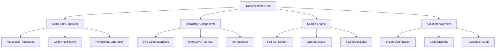

# Design Document

## Overview

The comprehensive documentation system for the AI Toolkit will be built as a modern, interactive documentation website inspired by React's documentation structure. The design emphasizes progressive disclosure, hands-on learning, and practical examples while maintaining excellent user experience across all device types. The documentation will be implemented as a static site generator with interactive components, search capabilities, and responsive design.

## Architecture

### High-Level Architecture



### Technology Stack

- **Static Site Generator**: Next.js with static export for optimal performance
- **Content Management**: MDX (Markdown + JSX) for rich, interactive content
- **Styling**: Sass with the existing design system from the AI Toolkit
- **Search**: Algolia DocSearch or local search with Fuse.js
- **Code Highlighting**: Prism.js with custom themes
- **Interactive Examples**: CodeSandbox embeds and live code runners
- **Deployment**: Static hosting (Netlify, Vercel, or GitHub Pages)

### Content Structure

```
docs-site/
├── content/
│   ├── getting-started/
│   │   ├── installation.mdx
│   │   ├── quick-start.mdx
│   │   └── first-example.mdx
│   ├── guides/
│   │   ├── document-processing/
│   │   ├── ai-integration/
│   │   ├── web-dashboard/
│   │   └── deployment/
│   ├── api-reference/
│   │   ├── rest-api/
│   │   ├── websocket-api/
│   │   └── package-apis/
│   ├── tutorials/
│   │   ├── basic-workflows/
│   │   ├── advanced-integration/
│   │   └── custom-development/
│   └── resources/
│       ├── troubleshooting/
│       ├── best-practices/
│       └── community/
├── components/
│   ├── interactive/
│   ├── layout/
│   └── ui/
├── public/
│   ├── examples/
│   ├── assets/
│   └── downloads/
└── styles/
    ├── components/
    ├── pages/
    └── globals/
```

## Components and Interfaces

### Core Components

#### 1. Documentation Layout Component
```typescript
interface DocumentationLayoutProps {
  children: React.ReactNode;
  sidebar: SidebarConfig;
  breadcrumbs: BreadcrumbItem[];
  tableOfContents: TOCItem[];
  editUrl?: string;
}

interface SidebarConfig {
  sections: SidebarSection[];
  currentPath: string;
  searchEnabled: boolean;
}
```

#### 2. Interactive Code Example Component
```typescript
interface CodeExampleProps {
  code: string;
  language: string;
  title?: string;
  description?: string;
  runnable?: boolean;
  files?: CodeFile[];
  dependencies?: string[];
}

interface CodeFile {
  name: string;
  content: string;
  language: string;
  hidden?: boolean;
}
```

#### 3. API Documentation Component
```typescript
interface APIDocumentationProps {
  endpoint: APIEndpoint;
  examples: APIExample[];
  authentication?: AuthenticationInfo;
  rateLimit?: RateLimitInfo;
}

interface APIEndpoint {
  method: HTTPMethod;
  path: string;
  description: string;
  parameters: Parameter[];
  responses: Response[];
  deprecated?: boolean;
}
```

#### 4. Tutorial Step Component
```typescript
interface TutorialStepProps {
  stepNumber: number;
  title: string;
  content: React.ReactNode;
  codeExample?: CodeExampleProps;
  expectedOutput?: string;
  troubleshooting?: TroubleshootingTip[];
  nextStep?: string;
}
```

#### 5. Search Interface Component
```typescript
interface SearchInterfaceProps {
  placeholder: string;
  categories: SearchCategory[];
  onSearch: (query: string, filters: SearchFilters) => void;
  results: SearchResult[];
  loading: boolean;
}

interface SearchResult {
  title: string;
  excerpt: string;
  url: string;
  category: string;
  relevance: number;
}
```

### Navigation System

#### Hierarchical Navigation Structure
```typescript
interface NavigationStructure {
  main: NavigationSection[];
  footer: FooterSection[];
  mobile: MobileNavigationConfig;
}

interface NavigationSection {
  title: string;
  path: string;
  icon?: string;
  children?: NavigationItem[];
  badge?: string; // "New", "Updated", etc.
}
```

#### Breadcrumb System
```typescript
interface BreadcrumbSystem {
  generateBreadcrumbs: (path: string) => BreadcrumbItem[];
  customBreadcrumbs?: Map<string, BreadcrumbItem[]>;
}

interface BreadcrumbItem {
  label: string;
  path: string;
  active: boolean;
}
```

## Data Models

### Content Management Models

#### 1. Documentation Page Model
```typescript
interface DocumentationPage {
  id: string;
  title: string;
  description: string;
  content: string; // MDX content
  frontmatter: PageFrontmatter;
  lastModified: Date;
  contributors: Contributor[];
  relatedPages: string[];
}

interface PageFrontmatter {
  title: string;
  description: string;
  category: string;
  tags: string[];
  difficulty: 'beginner' | 'intermediate' | 'advanced';
  estimatedReadTime: number;
  prerequisites?: string[];
}
```

#### 2. Code Example Model
```typescript
interface CodeExample {
  id: string;
  title: string;
  description: string;
  language: string;
  code: string;
  dependencies: Dependency[];
  category: string;
  difficulty: string;
  runnable: boolean;
  expectedOutput?: string;
}

interface Dependency {
  name: string;
  version: string;
  type: 'npm' | 'system' | 'service';
}
```

#### 3. API Documentation Model
```typescript
interface APIDocumentation {
  version: string;
  baseUrl: string;
  authentication: AuthenticationMethod[];
  endpoints: APIEndpoint[];
  schemas: JSONSchema[];
  examples: APIExample[];
}

interface APIExample {
  title: string;
  description: string;
  request: HTTPRequest;
  response: HTTPResponse;
  language: string; // curl, javascript, python, etc.
}
```

### User Experience Models

#### 1. Learning Path Model
```typescript
interface LearningPath {
  id: string;
  title: string;
  description: string;
  difficulty: string;
  estimatedTime: number;
  steps: LearningStep[];
  prerequisites: string[];
  outcomes: string[];
}

interface LearningStep {
  id: string;
  title: string;
  type: 'reading' | 'tutorial' | 'exercise' | 'quiz';
  content: string;
  estimatedTime: number;
  required: boolean;
}
```

#### 2. User Progress Model
```typescript
interface UserProgress {
  userId: string;
  completedPages: string[];
  bookmarkedPages: string[];
  learningPaths: LearningPathProgress[];
  preferences: UserPreferences;
}

interface UserPreferences {
  theme: 'light' | 'dark' | 'auto';
  codeTheme: string;
  fontSize: 'small' | 'medium' | 'large';
  showLineNumbers: boolean;
  autoRunExamples: boolean;
}
```

## Error Handling

### Content Validation System

#### 1. MDX Content Validation
```typescript
interface ContentValidator {
  validateMDX: (content: string) => ValidationResult;
  validateCodeExamples: (examples: CodeExample[]) => ValidationResult;
  validateLinks: (content: string) => LinkValidationResult[];
  validateImages: (content: string) => ImageValidationResult[];
}

interface ValidationResult {
  valid: boolean;
  errors: ValidationError[];
  warnings: ValidationWarning[];
}
```

#### 2. Build-time Error Handling
- **Broken Link Detection**: Scan all internal links during build
- **Missing Asset Detection**: Verify all referenced images and files exist
- **Code Example Validation**: Syntax check all code examples
- **Accessibility Validation**: Check for accessibility compliance

#### 3. Runtime Error Handling
```typescript
interface ErrorBoundary {
  fallbackComponent: React.ComponentType<ErrorFallbackProps>;
  onError: (error: Error, errorInfo: ErrorInfo) => void;
  resetOnPropsChange?: boolean;
}

interface ErrorFallbackProps {
  error: Error;
  resetError: () => void;
  hasError: boolean;
}
```

### User-Facing Error Messages

#### 1. Search Errors
- No results found with suggestions for alternative queries
- Search service unavailable with offline fallback
- Invalid search query with correction suggestions

#### 2. Content Loading Errors
- Page not found with navigation suggestions
- Content failed to load with retry mechanism
- Slow loading with progress indicators

#### 3. Interactive Example Errors
- Code execution failed with debugging hints
- Dependencies unavailable with alternative suggestions
- Timeout errors with performance tips

## Testing Strategy

### Content Testing

#### 1. Automated Content Validation
```typescript
interface ContentTestSuite {
  linkChecker: () => Promise<LinkCheckResult[]>;
  spellChecker: () => Promise<SpellCheckResult[]>;
  grammarChecker: () => Promise<GrammarCheckResult[]>;
  accessibilityChecker: () => Promise<A11yCheckResult[]>;
}
```

#### 2. Code Example Testing
- **Syntax Validation**: Ensure all code examples are syntactically correct
- **Execution Testing**: Run executable examples to verify they work
- **Dependency Checking**: Verify all dependencies are available and compatible
- **Output Validation**: Check that examples produce expected outputs

#### 3. User Experience Testing
```typescript
interface UXTestSuite {
  navigationTesting: () => Promise<NavigationTestResult>;
  searchTesting: () => Promise<SearchTestResult>;
  responsiveTesting: () => Promise<ResponsiveTestResult>;
  performanceTesting: () => Promise<PerformanceTestResult>;
}
```

### Integration Testing

#### 1. Build Process Testing
- **Static Generation**: Verify all pages generate correctly
- **Asset Optimization**: Check image and code optimization
- **Search Index**: Validate search index generation
- **Deployment**: Test deployment to various hosting platforms

#### 2. Cross-browser Testing
- **Modern Browsers**: Chrome, Firefox, Safari, Edge
- **Mobile Browsers**: iOS Safari, Chrome Mobile, Samsung Internet
- **Accessibility Tools**: Screen readers, keyboard navigation
- **Performance**: Core Web Vitals across different devices

### Quality Assurance

#### 1. Content Quality Metrics
```typescript
interface ContentQualityMetrics {
  readabilityScore: number;
  completenessScore: number;
  accuracyScore: number;
  usefulnessScore: number;
  upToDateScore: number;
}
```

#### 2. User Experience Metrics
- **Page Load Speed**: Target < 2 seconds for initial load
- **Search Response Time**: Target < 500ms for search results
- **Mobile Performance**: Target 90+ Lighthouse mobile score
- **Accessibility Score**: Target 100% WCAG 2.1 AA compliance

#### 3. Content Maintenance
```typescript
interface ContentMaintenance {
  outdatedContentDetection: () => Promise<OutdatedContent[]>;
  brokenLinkMonitoring: () => Promise<BrokenLink[]>;
  userFeedbackAnalysis: () => Promise<FeedbackAnalysis>;
  usageAnalytics: () => Promise<UsageMetrics>;
}
```

## Implementation Phases

### Phase 1: Foundation (Weeks 1-2)
- Set up Next.js project with MDX support
- Implement basic layout and navigation
- Create content structure and initial pages
- Set up build and deployment pipeline

### Phase 2: Core Content (Weeks 3-4)
- Write getting started documentation
- Create API reference documentation
- Implement search functionality
- Add responsive design and mobile optimization

### Phase 3: Interactive Features (Weeks 5-6)
- Build interactive code examples
- Create tutorial system with step-by-step guidance
- Implement user progress tracking
- Add advanced search with filtering

### Phase 4: Enhancement (Weeks 7-8)
- Add accessibility features and testing
- Implement performance optimizations
- Create content management workflows
- Add analytics and user feedback systems

This design provides a comprehensive foundation for creating world-class documentation that will serve as the primary resource for AI Toolkit users, following the proven patterns established by React's documentation while being tailored specifically for the AI Toolkit's unique features and user needs.